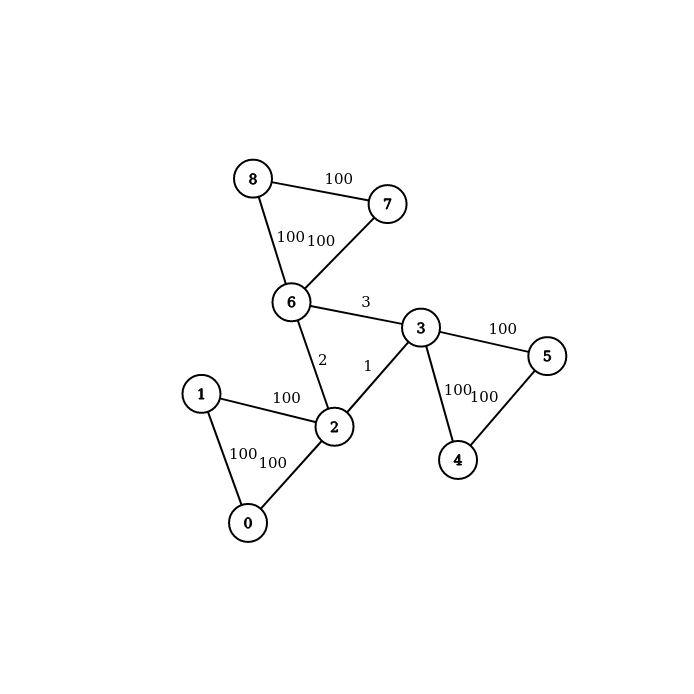

# Stoer-Wagner algorithm realisation

Here I try to explain why my code provides 
a correct realisation of the Stoer-Wagner algorithm.
***
### Code with explanation

Just some includes and definition of infinity.

```c++
#include <iostream>
#include <vector>
#include <algorithm>

const int INF = static_cast<int>(1e9);
```

**1. Graph** 

Edges here have only one parameter &mdash; weight.
```c++
struct Edge {
    int w;
};
```
Also we make a specific structure for the results of one step of SW algorithm.
```c++
struct Step_res{
    int s;
    int t;
    int Cut;
};
```
I made a structure for graph, it'll contain amount of vertices, 
vector `union` of size V, which purpose would be explained later, and
vector of vectors of edges &mdash; adjacency _matrix_ `adj`.

If edge doesn't exist, it's weight in `adj` is INF. Initially all edges have this weight.

While adding an edge we must remember that graph is undirected, 
and assign correct weight in both ways.

Function `SW_Step` implements a step of SW algorithm.

Function `SW_MinCut` returns the answer using `SW_Step`.

```c++
class Graph {
    int V;
    std::vector<bool> unioned;
    std::vector<std::vector<Edge>> adj;
public:
    Graph(int V) : V(V),
                   unioned(std::vector<bool>(V, false)),
                   adj(std::vector<std::vector<Edge>>(V, std::vector<Edge>(V, Edge{INF}))) {}
    // graph is undirected
    void addEdge(int u, int v, int w){
        adj[u][v].w = w;
        adj[v][u].w = w;
    }
    Step_res SW_Step(int k);
    int SW_MinCut();
};
```

**2. Algorithm realisation**

Firstly let's look at `SW_MinCut` function implementation. 
It calculates the answer &mdash; the general minimal cut in the graph.

It doesn't require any arguments
and firstly suggest that the answer `MinCut` is infinite 
(for further correctness of using `std::min`). 

The main idea is to calculate minimal cut between any two vertices
(via `SW_step`, which accepts current number of vertices)
while there are any, 
and then to unite them into one. This procedure is run _V-1_ times, 
because on the last step all the vertices would be unioned into one. 
On each step we update `MinCut`.

Let's clarify the process of unioning the vertices.
The result of `SW_Step` is an ordred pair of vertices (s, t) and a cut between them. 
Vector `unioned` says for every vertex if it is already unioned with something, or not.
When we unite vertices s and t,
we actually mark t as unioned and force s to behave like they're one with t:
we update all edges of s and add to them weights of the edges of t 
(of course not forgetting to check if the mentioned edges do really exist).

After all we return the answer.

```c++
int Graph::SW_MinCut() {
    int MinCut = INF;
    for (int i = 0; i < V-1; i++){
        Step_res SW = SW_Step(V-i);
        MinCut = std::min(MinCut, SW.Cut);
        unioned[SW.t] = true;
        for (int v = 0; v < V; v++){
            if (adj[SW.t][v].w != INF && SW.s != v) {
                adj[SW.s][v].w = (adj[SW.s][v].w == INF) ? adj[SW.t][v].w : adj[SW.s][v].w + adj[SW.t][v].w;
                adj[v][SW.s].w = adj[SW.s][v].w;
            }
        }
    return MinCut;
}
```
**Time complexity**: the calculation is very straightforward &mdash;
outer cycle, inner cycle, `SW_Step`. It must be _O_(V*[T(`SW_Step`)+V])
****

Now let's look closer at how does `SW_Step` work.

As we remember, step of SW is process of building set A of vertices.
Beginning from empty set we add a vertex with the heaviest set of edges
connected to vertices from A on each "step of step".

So we make enum class of relation of vertex v with set A. It can be in A,
can be connected to A (so \Sum_{ u \in A} w_{uv} can be calculated)
or can be _not_ connected to A.
```c++
enum class rel_with_A{
    in, connected, not_connected
};
```
`SW_step` accepts k &mdash; current amount of vertices in the graph.

We create a vector `A` to contain relations of vertices with the set A
as mentioned earlier, initially all vertices are not connected to A.
And a vector `weight_v_A` to store \Sum_{ u \in A} w_{uv} for every vertex v.
Initially all weights are zero.

`res` will be the answer the function returns. Initially the indices of vertices are incorrect,
and the minimal cut is infinite.
```c++
Step_res Graph::SW_Step(int k){
    std::vector<rel_with_A> A(V, rel_with_A::not_connected);
    std::vector<int> weight_v_A(V, 0);
    Step_res res{-1, -1, INF};
```
We run our algorithm k times, because |A| gets from 0 to k in exactly k steps.
First goal is to find a vertex with current maximal weight &mdash;
maximal value in `weight_v_A`. We do it via linear search. The answer is vertex `u`.
```c++
    for (int i = 0; i < k; i++){ // |V| times
        int u = 0;
        for (int v = 0; v < V; v++){
            if (!unioned[v] && A[v] == rel_with_A::connected) {
                if (A[u] != rel_with_A::connected|| unioned[u]) {
                    u = v;
                } else {
                    u = (weight_v_A[v] > weight_v_A[u]) ? v : u;
                }
            }
        }
```
Then we add it into `A` and update the result.
We know that the vertices s and t we are searching are the _k-1_-th and the _k_-th added to A,
and the cut is exactly the weight of t. That's why update of `res` looks like that.  
```c++
        A[u] = rel_with_A::in;
        res.s = res.t;
        res.t = u;
        res.Cut = weight_v_A[u];
```
Then we update the weights of vertices and their relations with set A.

And return the answer.
```c++
        for (int v = 0; v < V; v++){
            if (adj[u][v].w != INF && A[v] != rel_with_A::in) {
                weight_v_A[v] += adj[u][v].w;
                A[v] = rel_with_A::connected;
            }
        }
    }
    return res;
}
```
**Time complexity**: creation of two new vectors, outer cycle and inner cycles 
must give _O_(V^2).

****

**Time complexity of the whole algorithm:** _O_(V*[T(`SW_Step`)+V]) = 
_O_(V*[_O_(V^2)+V]) = _O_(V^3).
***
### Tests

Now let's provide some tests that prove that algorithm works correctly.

1.

.png)
Input
```c++
2 1
0 1 1
```
Output 
```c++
1
```
***
2.

.png)
Input
```c++
5 10
0 1 1
0 2 2
0 3 3
0 4 4
1 2 5
1 3 6
1 4 7
2 3 8
2 4 9
3 4 10
```
Output 
```c++
10
```
***
3.
.png)
Input
```c++
6 7
0 1 100
0 2 100
1 2 100
3 4 100
4 5 100
3 5 100
0 3 1
```
Output
```c++
1
```

***
4.
.png)
Input
```c++
6 7
0 1 1
0 2 1
1 2 1
3 4 1
4 5 1
3 5 1
0 3 3
```
Output
```c++
2
```

***
5.

Input
```c++
9 12
0 1 100
0 2 100
1 2 100
2 3 1
3 4 100
4 5 100
3 5 100
2 6 2
3 6 3
6 7 100
7 8 100
6 8 100
```
Output
```c++
3
```
***
6.
.png)
Input 
```c++
8 12
0 1 2
0 4 3
1 5 2
4 5 3
1 4 2
1 2 3
5 6 1
6 2 2
2 3 4
6 7 3
6 3 2
3 7 2
```
Output 
```c++
4
```